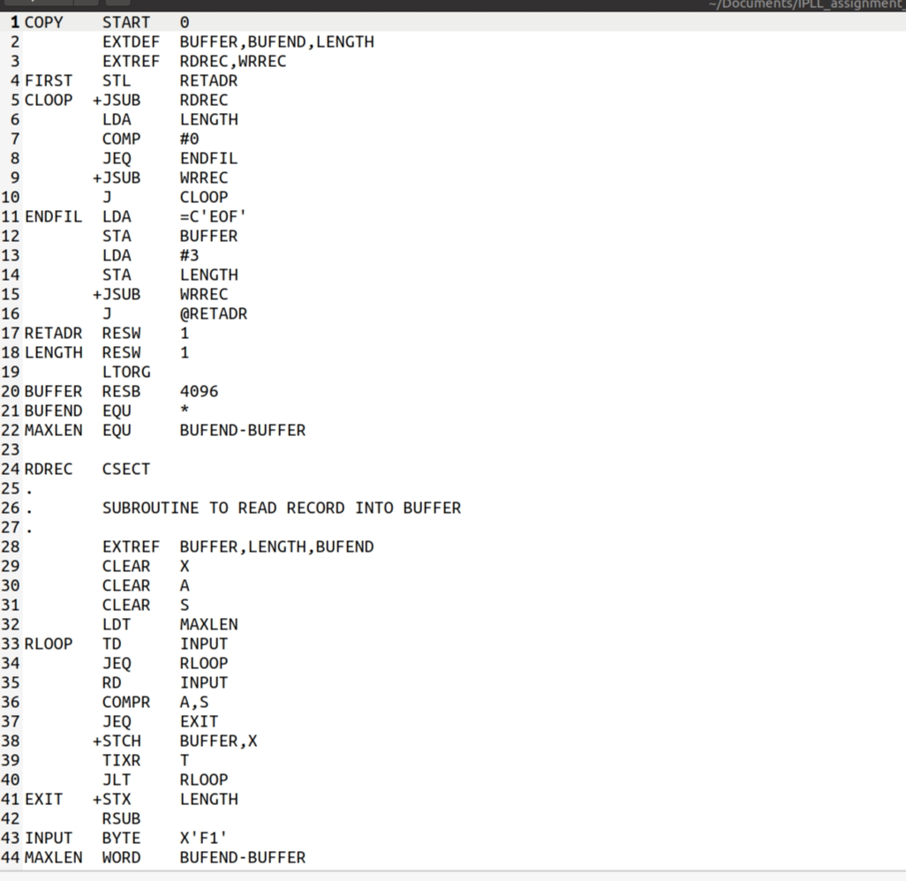
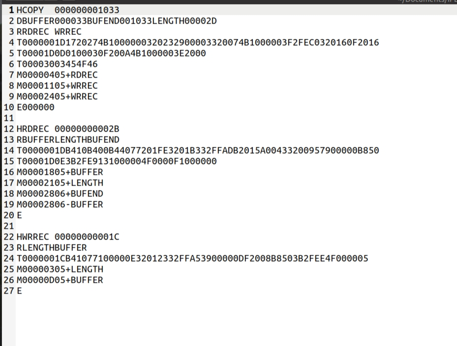

# Implementation-of-System-Software

System Software consists of variety of programs that support the operations of computer. This software makes it possible for the user to focus on application or other problem without needind to know the details of how the machine works internally

In this Project we implemented two system softwares for SIC/XE machine architecture

* ASSEMBLER
* LINKING LOADER

## ASSEMBLER

The main function that any assembler must perform is translating mnemonic operation codes to their machine language equivalents and assigning machine addresses to symbolic labels used by programmer. The assembler we implemented takes the assembler language program as input and generates the object code and writes into the output file in a format which contains header records and text records.

Sample assembly language program is shown below

The assembler produces the output object code shown below

